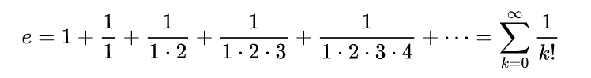

# PLF 18.4.2024

## Klassen: 1AHWII / 4AAIF

### Themen: Javascript Basics if/else, Schleifen, Klassen

## Aufgabe 1: gegeben ist folgendes UML Diagramm

... für eine Quiz-Anwendung:

```plantuml
class Frage {
+ constructor(obj)
- #frage : String
- #antwort : String
- #optionen : String[]
+ isRichtig(String) : boolean
+ optionen : String[] (readonly)
+ frage : String (readonly)
}
```

In der Datei `fragen.js` wird ein JSON Objekt exportiert, welches ein Array aus Fragen beinhaltet. Jedes dieser Objekte kann als Parameter für den construktor obiger `Frage`-Klasse verwendet werden.

Programmieren Sie die Datei `plf.js` und beachten Sie die dortigen Kommentare!

Implementieren Sie den constructor derart, dass das übergebene Objekt die privaten Variablen befüllt.

`optionen` soll als property implementiert werden. Beim Lesen dieses properties soll das private `optionen`-Objekt zurückgegeben werden, beim Schreiben dieses properties soll eine exception geworfen werden.

`frage` soll als reine readonly property implementiert werden. Ein Schreiben des `frage` properties möge "schweigend" nichts tun.

Letztlich soll die Methode `isRichtig(String)` `true` zurückliefern, wenn der übergebene String ident mit der Antwort ist, andernfalls `false`.

In `package.json` unter "scripts" findet sich "start" und "test" zum Ausführen, mit und ohne debugging Modus.

## Aufgabe 2: Berechnen der Euler'schen Zahl *e*

Die Berechnung von *e* ist wie folgt definiert:



Machen Sie aus `eulerZahl` eine `function`, welche in 20 Iterationen die Zahl berechnet und zurückgibt.

### Gutes Gelingen!